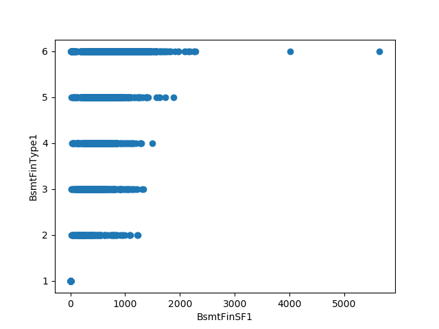
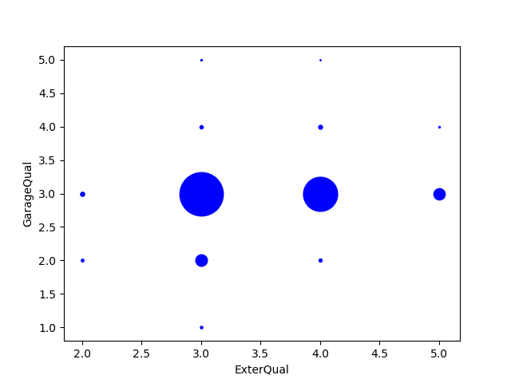
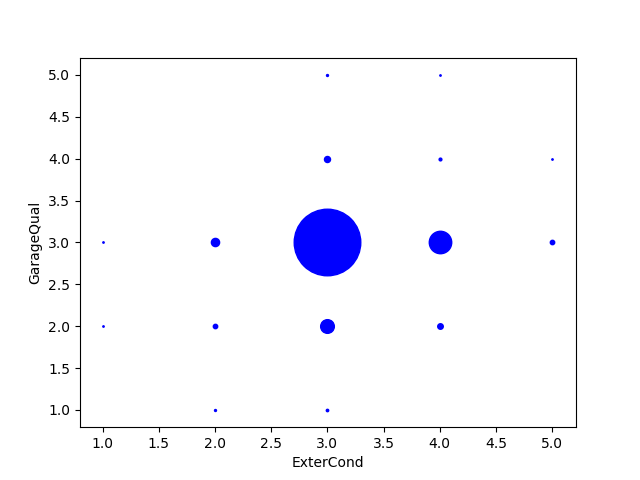
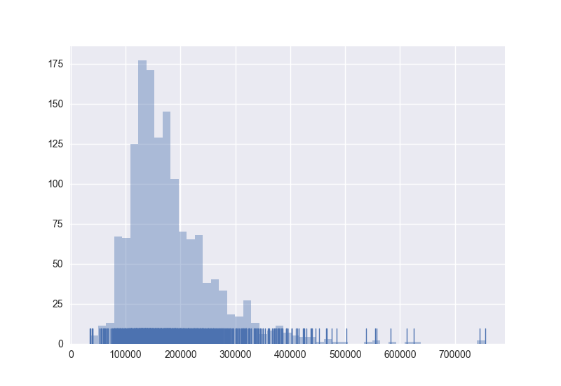
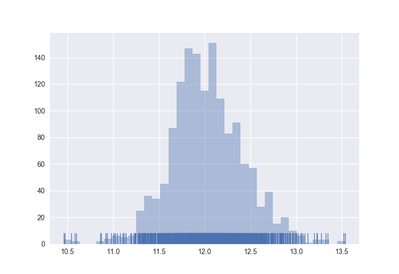

# House Price in Kaggle


# Table of Contents

* [Preprocessing](#preprocessing)
  * [Remove Columns](#remove-columns)
  * [Fill Missing Values](#fill-missing-values)
  * [Encoding with Domain Knowledge](#encoding-with-domain-knowledge)
  * [Remove Outliers](#remove-outliers)
* [Feature Effects](#)


## Preprocessing

### Remove Columns

```python
>>>missing_count = dataframe.isnull().sum()
>>>col_remove = missing_count[missing_count > rownum * .4]
>>>colname_remove = col_remove.index.tolist()

Alley          2721
FireplaceQu    1420
PoolQC         2909
Fence          2348
MiscFeature    2814
```

Because filling missing values is based on the information provided by the original feature, so it will be extremely hard to extract enough information from a feature with too many missing values. Most of significant relations have already lost, and the "made-up" values to fill these missing values may cause the original feature unconvincible. 

Thus, those columns will be removed because of too many missing values.


###  Fill Missing Values

```python
>>> df.isnull().sum()[df.isnull().sum()>0]

MSZoning          4
LotFrontage     486
Utilities         2
Exterior1st       1
Exterior2nd       1
MasVnrType       24
MasVnrArea       23
BsmtQual         81
BsmtCond         82
BsmtExposure     82
BsmtFinType1     79
BsmtFinSF1        1
BsmtFinType2     80
BsmtFinSF2        1
BsmtUnfSF         1
TotalBsmtSF       1
Electrical        1
BsmtFullBath      2
BsmtHalfBath      2
KitchenQual       1
Functional        2
GarageType      157
GarageYrBlt     159
GarageFinish    159
GarageCars        1
GarageArea        1
GarageQual      159
GarageCond      159
SaleType          1
dtype: int64
```

After that, only 29 out of 74 features still have missing values and lots of them only have a couple of missing values.

Therefore, I would use **mode** to fill missing values from those columns with only a couple of NAs. 

```python
df['MSZoning'].fillna(statistics.mode(df['MSZoning']),
                      inplace=True)
df['Utilities'].fillna(statistics.mode(df['Utilities']),
                       inplace=True)
df['Exterior1st'].fillna(statistics.mode(df['Exterior1st']),
                         inplace=True)
df['Exterior2nd'].fillna(statistics.mode(df['Exterior2nd']),
                         inplace=True)
df['MasVnrArea'].fillna(0,
                        inplace=True)
df['MasVnrType'].fillna('None',
                        inplace=True)
df['Electrical'].fillna(statistics.mode(df['Electrical']), 
                        inplace=True)
df['KitchenQual'].fillna(statistics.mode(df['KitchenQual']), 
                         inplace=True)
df['Functional'].fillna(statistics.mode(df['Functional']), 
                        inplace=True)
df['SaleType'].fillna(statistics.mode(df['SaleType']), 
                      inplace=True)
```


Now there are only 12 columns still having missing values. 

```python
BsmtQual         81
BsmtCond         82
BsmtExposure     82
BsmtFinType1     79
BsmtFinType2     80
GarageType      157
GarageYrBlt     159
GarageFinish    159
GarageCars        1
GarageArea        1
GarageQual      159
GarageCond      159
dtype: int64
```

Since those features contains many missing values, so it may not be wise to use **mean**, **median** or **mode** to interpolate those empty items. Hence, I tried to build a regression and to find out potential patterns among those features.

Those features are divided into two kinds, basement and garage. 

First I anlyzed features about basement. Those dots' sizes increase as values increase in following plots.


From those 4 plots above, it's obvious that `BsmtQual` has relations with `ExterQual` and `OverallQual`. Therefore, a simple linear regression will be built to fill those missing values in `BsmtQual`.


However, I can find that `BsmtCond` has no significant relation with `OverallCond`, `ExterCond`, `ExterQual` or `OverallQual`.  Thus, `"TA"`, corresponding to `3`, is a reasonable value fill missing values in `BsmtCond`.




There is a weak pattern between `BsmtFinType1` and `BsmtFinSF1`. So I built a linear regression to fill missing values in `BsmtFinType1.


I assume that `GarageQual` may have some potential relations with `ExterQual`, `ExterCond` or `OverallQual`.






From those plots above, most of values from `GarageQual` are located at `3` which corresponding to `Typical/Average`. Thus, I will fill missing values in `GarageQual` with `3`.

Same condition happends to `GarageCond`, and those missing values in `GarageCond` are filled with `3` corresponding to `Typical/Average`.


Moreover, I could not find other very strong relations between variables with NAs and which without NAs. So, as a expediency, I used **mode** to fill NAs in each variable.


Original Price Distribution



Price Distribution after Logarithm




### Remove Outliers

Outliers undoutebly affect the predition accuracy significantly especially in regression. Thus, I drew histogram for every numeric feature and decided a boundary for each feature.

```python
df.drop(df[df["LotArea"] > 100000].index,
        inplace = True)
df.drop(df[df["LotFrontage"] > 200].index,
        inplace=True)
df.drop(df[df["BsmtFinSF1"] > 3000].index,
        inplace=True)
df.drop(df[df["BsmtFinSF2"] > 1000].index,
        inplace=True)
df.drop(df[df["MasVnrArea"] > 1000].index,
        inplace=True)
df.drop(df[df["1stFlrSF"] > 3000].index,
        inplace=True)
df.drop(df[df["GrLivArea"] > 4500].index,
        inplace=True)
df.drop(df[df["LowQualFinSF"] > 600].index,
        inplace=True)
df.drop(df[df["TotalBsmtSF"] > 4000].index,
        inplace=True)
df.drop(df[df["3SsnPorch"] > 300].index,
        inplace=True)
df.drop(df[df["EnclosedPorch"] > 500].index,
        inplace=True)
df.drop(df[df["GarageYrBlt"] > 2010].index,
        inplace=True)
df.drop(df[df["OpenPorchSF"] > 400].index,
        inplace=True)
df.drop(df[df["WoodDeckSF"] > 800].index,
        inplace=True)
df.drop(df[df["MiscVal"] > 5000].index,
        inplace=True)
df.drop(df[df["PoolArea"] > 200].index,
        inplace=True)
df.drop(df[df["ScreenPorch"] > 400].index,
        inplace=True)
```


After removing outliers, my local test accuracy raises up to $0.120237 \pm 0.007230$.


#### Encoding with Domain Knowledge


