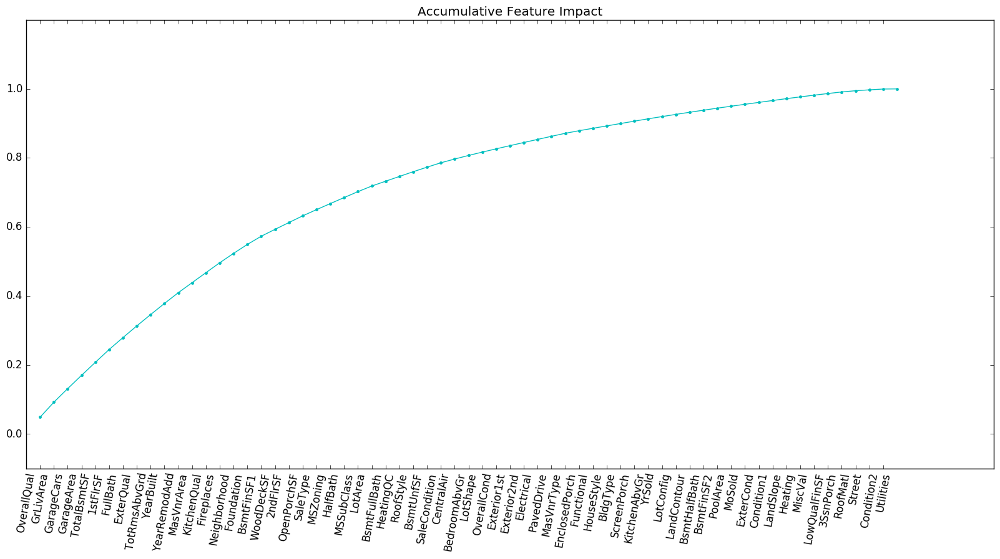

## House Price Prediction

The feature importance is calculated by **Pearson Correlation Coefficents** and **Mutual Information**.

This plot cannot show significant difference between important features and less important ones. 

So I accumulate feature impact ratios to see if it's more clear.

No! It's more ambiguous!

### Feature Engineering with domain knowledge

#### Interpolation

**LotFrontage**: Interpolation by linear regression on MSSubClass, MSZoning, LotArea.

#### Encoding

**LotShap**: Reg ——— 4; IR1 ——— 3; IR2 ——— 2; IR3 ——— 1

**Utilities**: AllPub ——— 4; NoSewr ——— 3; NoSeWa ——— 2; ELO ——— 1

**LandSlope**: Gtl —— 3; Mod —— 2; Sev —— 1

**BldgType**: 1Fam ——— 5; 2FmCon ——— 4; Duplx ——— 3; TwnhsE ——— 2; TwnhsI ——— 1

**HouseStyle**: SLvl —— 6; SFoyer —— 5; 2.5Fin —— 4; 2.5Unf —— 3.5; 2Story —— 3; 1.5Fin —— 2; 1.5Unf —— 1.5; 1Story —— 1

