# House Price in Kaggle


# Table of Contents

* [Preprocessing](#Preprocessing)
  * [Remove Columns](#remove columns)
  * [Fill Missing Values](#fill missing values)
* [Feature Effects](#Feature Effects)


## Preprocessing

### Remove Columns

```python
>>>missing_count = dataframe.isnull().sum()
>>>col_remove = missing_count[missing_count > rownum * .4]
>>>colname_remove = col_remove.index.tolist()

Alley          2721
FireplaceQu    1420
PoolQC         2909
Fence          2348
MiscFeature    2814
```

Because filling missing values is based on the information provided by the original feature, so it will be extremely hard to extract enough information from a feature with too many missing values. Most of significant relations have already lost, and the "made-up" values to fill these missing values may cause the original feature unconvincible. 

Thus, those columns will be removed because of too many missing values.


###  Fill Missing Values

```python
>>> df.isnull().sum()[df.isnull().sum()>0]

MSZoning          4
LotFrontage     486
Utilities         2
Exterior1st       1
Exterior2nd       1
MasVnrType       24
MasVnrArea       23
BsmtQual         81
BsmtCond         82
BsmtExposure     82
BsmtFinType1     79
BsmtFinSF1        1
BsmtFinType2     80
BsmtFinSF2        1
BsmtUnfSF         1
TotalBsmtSF       1
Electrical        1
BsmtFullBath      2
BsmtHalfBath      2
KitchenQual       1
Functional        2
GarageType      157
GarageYrBlt     159
GarageFinish    159
GarageCars        1
GarageArea        1
GarageQual      159
GarageCond      159
SaleType          1
dtype: int64
```

After that, only 29 out of 74 features still have missing values and lots of them only have a couple of missing values.

Therefore, I would use **mode** to fill missing values from those columns with only a couple of NAs. 

```python
df['MSZoning'].fillna(statistics.mode(df['MSZoning']),
                      inplace=True)
df['Utilities'].fillna(statistics.mode(df['Utilities']),
                       inplace=True)
df['Exterior1st'].fillna(statistics.mode(df['Exterior1st']),
                         inplace=True)
df['Exterior2nd'].fillna(statistics.mode(df['Exterior2nd']),
                         inplace=True)
df['MasVnrArea'].fillna(0,
                        inplace=True)
df['MasVnrType'].fillna('None',
                        inplace=True)
df['Electrical'].fillna(statistics.mode(df['Electrical']), 
                        inplace=True)
df['KitchenQual'].fillna(statistics.mode(df['KitchenQual']), 
                         inplace=True)
df['Functional'].fillna(statistics.mode(df['Functional']), 
                        inplace=True)
df['SaleType'].fillna(statistics.mode(df['SaleType']), 
                      inplace=True)
```


Now there are only 12 columns still having missing values. 

```python
BsmtQual         81
BsmtCond         82
BsmtExposure     82
BsmtFinType1     79
BsmtFinType2     80
GarageType      157
GarageYrBlt     159
GarageFinish    159
GarageCars        1
GarageArea        1
GarageQual      159
GarageCond      159
dtype: int64
```

Since those features contains many missing values, so it may not be wise to use **mean**, **median** or **mode** to interpolate those empty items. Hence, I tried to build a regression and to find out potential patterns among those features.

Those features are divided into two kinds, basement and garage. 

First I anlyzed features about basement. Those dots' sizes increase as values increase in following plots.

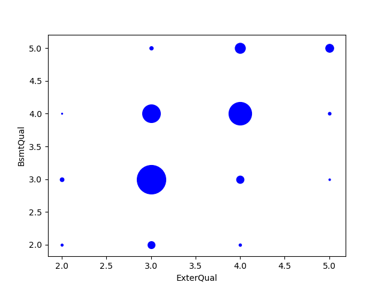

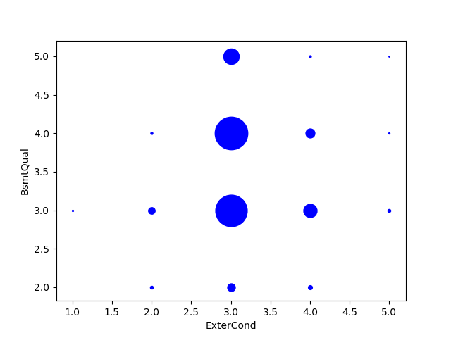

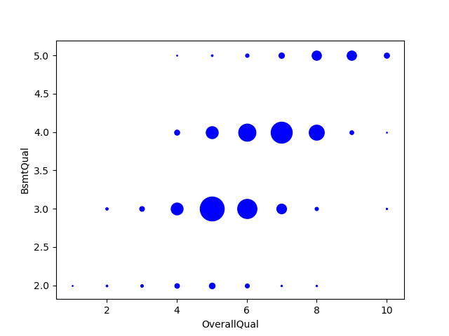

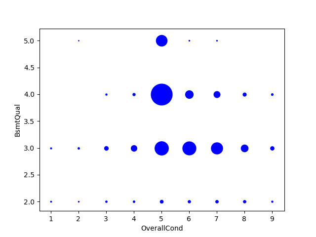

From those 4 plots above, it's obvious that `BsmtQual` has relations with `ExterQual` and `OverallQual`. Therefore, a simple linear regression will be built to fill those missing values in `BsmtQual`.


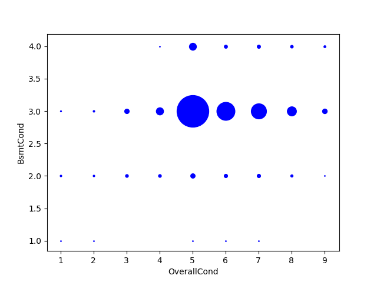

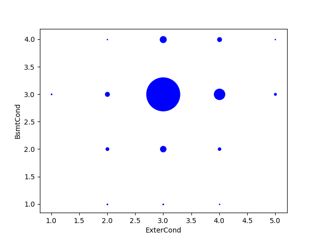

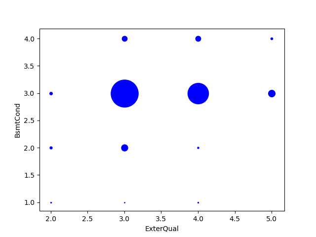

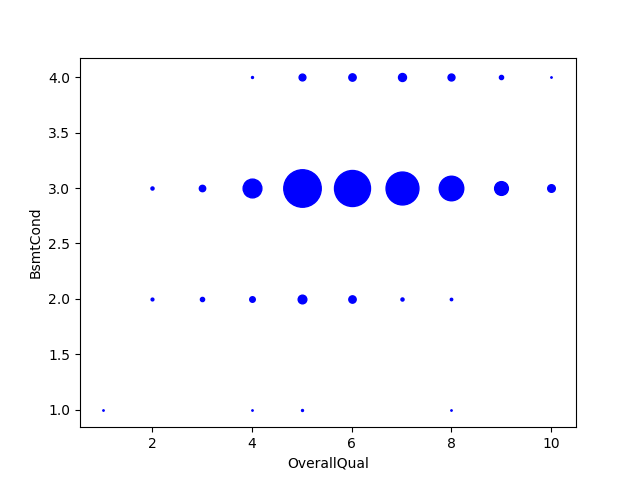

However, I can find that `BsmtCond` has no significant relation with `OverallCond`, `ExterCond`, `ExterQual` or `OverallQual`.  Thus, `"TA"`, corresponding to `3`, is a reasonable value fill missing values in `BsmtCond`.


## Feature Effects

The feature importance is calculated by **Pearson Correlation Coefficents** and **Mutual Information**.

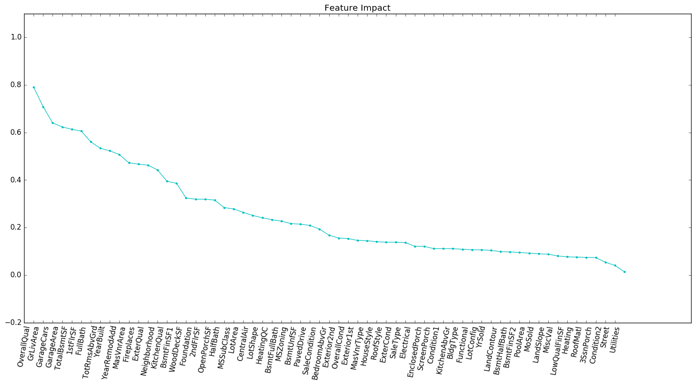


This plot cannot show significant difference between important features and less important ones. 

So I accumulate feature impact ratios to see if it's more clear.

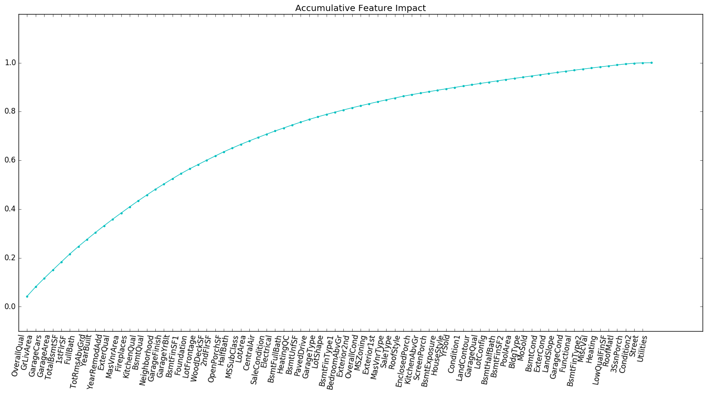

No! It's more ambiguous!


Price distribution

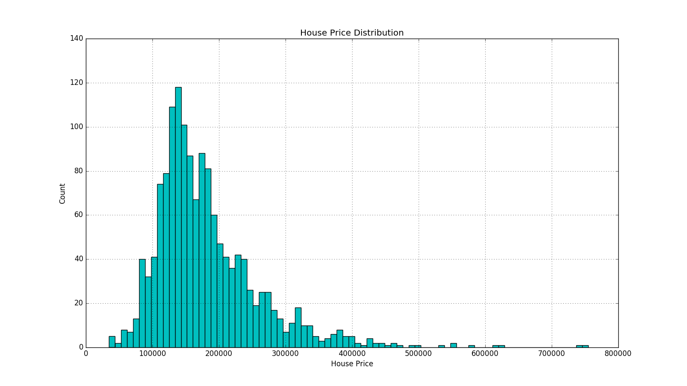


### Features with severe collinearity


### Feature Engineering with domain knowledge

#### Interpolation

**LotFrontage**: Interpolation by linear regression on MSSubClass, MSZoning, LotArea.


#### Encoding (Do more importance features first)

**LotShap**: Reg ——— 4; IR1 ——— 3; IR2 ——— 2; IR3 ——— 1

**Utilities**: AllPub ——— 4; NoSewr ——— 3; NoSeWa ——— 2; ELO ——— 1

**LandSlope**: Gtl —— 3; Mod —— 2; Sev —— 1

**BldgType**: 1Fam ——— 5; 2FmCon ——— 4; Duplx ——— 3; TwnhsE ——— 2; TwnhsI ——— 1

**HouseStyle**: SLvl —— 6; SFoyer —— 5; 2.5Fin —— 4; 2.5Unf —— 3.5; 2Story —— 3; 1.5Fin —— 2; 1.5Unf —— 1.5; 1Story —— 1

**ExterQual**: Ex —— 5; Gd —— 4; TA —— 3; Fa —— 2; Po —— 1

**ExterCond**: Ex —— 5; Gd —— 4; TA —— 3; Fa —— 2; Po —— 1

**Foundation**: PConc —— 4; CBlock —— 3; BrkTil —— 2; Slab, Stone, Wood —— 1

**BsmtQual**: Ex —— 5; Gd —— 4; TA —— 3; Fa —— 2; Po —— 1, NA ——0

**BsmtCond**: Ex —— 5; Gd —— 4; TA —— 3; Fa —— 2; Po —— 1, NA —— 0

**BsmtExposure**: Gd —— 4; Av —— 3; Mn —— 2; No —— 1; NA —— 0

**BsmtFinType1**: GLQ —— 6; ALQ —— 5; BLQ —— 4; Rec —— 3; LwQ —— 2; Unf —— 1; NA —— 0

**BsmtFinType2**: GLQ —— 6; ALQ —— 5; BLQ —— 4; Rec —— 3; LwQ —— 2; Unf —— 1; NA —— 0

**HeatingQC**: Ex —— 5; Gd —— 4; TA —— 3; Fa —— 2; Po —— 1

**CentralAir**: Y —— 1; N —— 0

**KitchenQual**: Ex —— 5; Gd —— 4; TA —— 3; Fa —— 2; Po —— 1

**FireplaceQu**: Ex —— 5; Gd —— 4; TA —— 3; Fa —— 2; Po —— 1, NA ——0

**GarageType**: 2Types —— 6; Attchd —— 5; Basment —— 4; BuiltIn —— 3; CarPort —— 2; Detchd —— 1; NA —— 0

**GarageFinish**: Fin —— 3; RFn —— 2; Unf —— 1; NA —— 0

**GarageQual**: Ex —— 5; Gd —— 4; TA —— 3; Fa —— 2; Po —— 1, NA —— 0

**GarageCond**: Ex —— 5; Gd —— 4; TA —— 3; Fa —— 2; Po —— 1, NA —— 0

